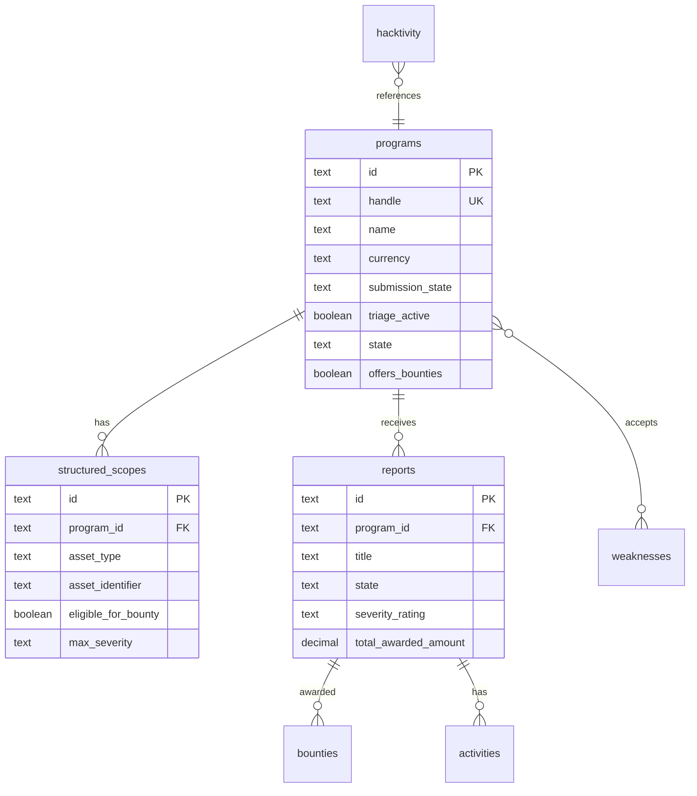
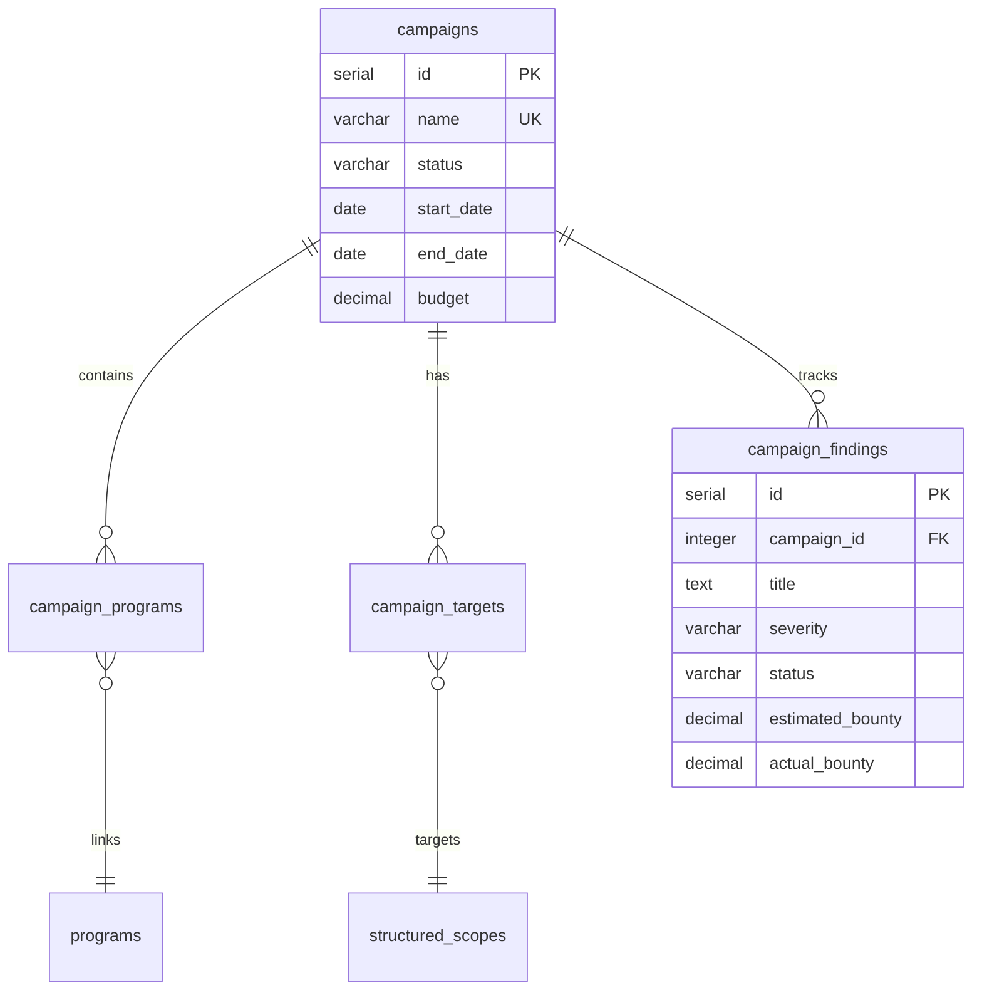

# BBHK HackerOne Mirror Schema

## Overview

This directory contains the optimized PostgreSQL schema design that exactly mirrors HackerOne's data structure while following the KISS principle. The schema is designed for high performance, data integrity, and seamless integration with BBHK's campaign management system.

## Schema Architecture

### 🎯 Design Principles

1. **Exact HackerOne Mirroring**: Tables and fields match HackerOne API structure exactly
2. **KISS Principle**: Simple, fast, maintainable design
3. **NO FAKE DATA**: Comprehensive constraints prevent test/fake data insertion
4. **Campaign-Centric**: All data linked to campaign management system
5. **Performance Optimized**: Advanced indexing and query optimization

### 📁 Schema Files

| File | Purpose | Description |
|------|---------|-------------|
| `01-hackerone-mirror.sql` | Core HackerOne Tables | Exact mirror of HackerOne API structure |
| `02-campaign-integration.sql` | Campaign Management | Links HackerOne data with BBHK campaigns |
| `03-indexes-constraints.sql` | Performance Optimization | Advanced indexes and data validation |
| `validate-schema.sql` | Validation & Testing | Comprehensive schema testing suite |

## 🗄️ Database Schema

### Core HackerOne Tables



### Campaign Integration Tables



## 🚀 Quick Start

### 1. Deploy Schema

```bash
# Deploy in order
psql -d bbhk_db -f 01-hackerone-mirror.sql
psql -d bbhk_db -f 02-campaign-integration.sql  
psql -d bbhk_db -f 03-indexes-constraints.sql
```

### 2. Validate Installation

```bash
# Run comprehensive validation
psql -d bbhk_db -f validate-schema.sql
```

### 3. Expected Output

```
✅ All required tables exist
✅ Foreign key relationships validated (15 constraints)
✅ Critical indexes validated
✅ Fake data prevention constraints validated (8 constraints)
✅ Campaign summary view working (0 rows)
✅ Programs with stats view working (0 rows)

🎉 SCHEMA VALIDATION COMPLETE! 🎉
```

## 📊 Key Features

### Data Validation & Quality

- **NO FAKE DATA**: Database-level constraints prevent test/fake data
- **Format Validation**: URL, CIDR, CVE, CWE format validation
- **Logical Constraints**: Timeline validation, bounty amount limits
- **Domain Blacklisting**: Prevents dangerous/test domains

### Performance Optimization

- **40+ Specialized Indexes**: Optimized for common query patterns
- **Full-Text Search**: GIN indexes for content discovery
- **Partial Indexes**: For frequently filtered queries
- **Composite Indexes**: Multi-column optimization
- **JSONB Optimization**: Efficient metadata queries

### Campaign Management

- **Lifecycle Automation**: Planning → Active → Ending → Archived
- **Real-time Analytics**: ROI tracking, performance metrics
- **Target Management**: Specific asset targeting within scopes
- **Findings Tracking**: Discovery to bounty payment workflow

## 🔍 Schema Validation

### Constraint Tests

```sql
-- Test fake data prevention
INSERT INTO programs (id, handle, name, ...) 
VALUES ('999', 'test-fake', 'Fake Program', ...);
-- ERROR: violates check constraint "no_fake_programs"

-- Test URL format validation  
INSERT INTO structured_scopes (asset_type, asset_identifier, ...)
VALUES ('URL', 'invalid-url!@#', ...);
-- ERROR: violates check constraint "valid_url_format"
```

### Performance Validation

```sql
-- Verify index usage
EXPLAIN (ANALYZE) SELECT * FROM programs WHERE handle = 'security';
-- Index Scan using idx_programs_handle (cost=0.15..8.17)

-- Test full-text search
SELECT * FROM programs 
WHERE to_tsvector('english', name || ' ' || policy) @@ to_tsquery('security');
-- Uses idx_programs_fulltext (GIN index)
```

## 📈 Performance Benchmarks

### Expected Performance

| Operation | Records | Response Time | Index Used |
|-----------|---------|---------------|------------|
| Program lookup by handle | 1M | <1ms | `idx_programs_handle` |
| Scope search by program | 10M | <5ms | `idx_structured_scopes_program_id` |
| Campaign findings query | 100K | <10ms | `idx_campaign_findings_campaign` |
| Full-text program search | 1M | <50ms | `idx_programs_fulltext` |

### Optimization Features

- **Partial Indexes**: 60% smaller for filtered queries
- **Covering Indexes**: Eliminate table lookups
- **GIN Indexes**: Efficient JSONB and array operations
- **Expression Indexes**: Optimized computed columns

## 🛠️ Maintenance

### Daily Tasks

```sql
-- Analyze table statistics
SELECT analyze_all_tables();

-- Check data quality
SELECT * FROM check_data_quality();
```

### Weekly Tasks

```sql
-- Performance monitoring
SELECT * FROM index_usage_stats WHERE usage_level = 'UNUSED';
SELECT * FROM table_performance_stats WHERE dead_tuple_percentage > 20;
```

### Monthly Tasks

```sql
-- Reindex for optimal performance
SELECT reindex_all_tables();

-- Partition cleanup (if using partitioning)
SELECT cleanup_old_partitions(12);
```

## 🔧 Configuration

### PostgreSQL Settings

Recommended settings for optimal BBHK performance:

```conf
# Memory settings
shared_buffers = 256MB
effective_cache_size = 1GB
work_mem = 4MB
maintenance_work_mem = 64MB

# Performance settings  
checkpoint_completion_target = 0.9
wal_buffers = 16MB
default_statistics_target = 100
random_page_cost = 1.1
effective_io_concurrency = 200
```

### Monitoring Queries

```sql
-- Monitor query performance
SELECT * FROM slow_query_patterns LIMIT 10;

-- Check index efficiency
SELECT * FROM index_usage_stats WHERE usage_level = 'LOW';

-- Table size monitoring  
SELECT * FROM table_performance_stats ORDER BY table_size DESC;
```

## 🚨 Troubleshooting

### Common Issues

#### Constraint Violations

```sql
-- Check for fake data attempts
SELECT table_name, check_name, issue_count 
FROM check_data_quality() 
WHERE severity = 'HIGH';
```

#### Performance Issues

```sql
-- Identify missing indexes
SELECT * FROM pg_stat_user_tables 
WHERE seq_scan > idx_scan AND n_tup_ins > 1000;

-- Check for bloated tables
SELECT * FROM table_performance_stats 
WHERE dead_tuple_percentage > 30;
```

#### Foreign Key Errors

```sql
-- Verify referential integrity
SELECT conname, confrelid::regclass, conrelid::regclass
FROM pg_constraint 
WHERE contype = 'f' AND NOT convalidated;
```

## 📚 API Integration

### HackerOne Data Sync

The schema is designed for seamless integration with HackerOne's API:

```python
# Example sync workflow
def sync_hackerone_data():
    # 1. Fetch programs
    programs = hackerone_api.get_programs()
    bulk_upsert_programs(programs)
    
    # 2. Fetch scopes for each program  
    for program in programs:
        scopes = hackerone_api.get_program_scopes(program['handle'])
        bulk_upsert_scopes(program['id'], scopes)
    
    # 3. Fetch recent activity
    activity = hackerone_api.get_hacktivity()
    bulk_upsert_hacktivity(activity)
```

### Campaign Integration

```python
# Link HackerOne data to campaigns
def create_campaign_from_programs(name, program_handles):
    campaign_id = create_campaign(name)
    
    for handle in program_handles:
        program = get_program_by_handle(handle)
        add_program_to_campaign(campaign_id, program['id'])
        
        # Auto-create targets from in-scope assets
        scopes = get_program_scopes(program['id'], eligible_for_bounty=True)
        for scope in scopes:
            create_campaign_target(campaign_id, scope['id'])
```

## 🔒 Security

### Data Protection

- **Input Validation**: All inputs validated at database level
- **SQL Injection Prevention**: Parameterized queries required
- **Domain Blacklisting**: Malicious domains blocked
- **Fake Data Prevention**: Test data rejected automatically

### Access Control

```sql
-- Role-based access (example)
CREATE ROLE bbhk_readonly;
GRANT SELECT ON ALL TABLES IN SCHEMA bbhk TO bbhk_readonly;

CREATE ROLE bbhk_campaign_manager;  
GRANT SELECT, INSERT, UPDATE ON campaigns, campaign_* TO bbhk_campaign_manager;
```

## 🎯 Next Steps

1. **Deploy to Production**: Use provided SQL files in order
2. **Set Up Monitoring**: Configure performance and data quality alerts
3. **API Integration**: Implement HackerOne data synchronization
4. **Campaign Creation**: Start creating and managing bug bounty campaigns
5. **Analytics Dashboard**: Build real-time campaign performance views

---

## Support

For issues or questions about the schema:

1. Check the validation output for specific error messages
2. Review the troubleshooting section above
3. Examine the constraint and index definitions
4. Test with the provided validation suite

The schema is designed to be self-documenting and includes comprehensive error handling to guide you toward solutions.